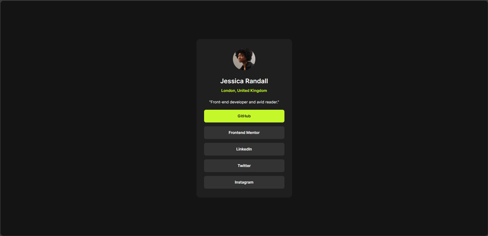

# Frontend Mentor - Social links profile solution

This is a solution to the [Social links profile challenge on Frontend Mentor](https://www.frontendmentor.io/challenges/social-links-profile-UG32l9m6dQ). Frontend Mentor challenges help you improve your coding skills by building realistic projects.

## Table of contents

- [Overview](#overview)
  - [The challenge](#the-challenge)
  - [Screenshot](#screenshot)
  - [Links](#links)
- [My process](#my-process)
  - [Built with](#built-with)
  - [What I learned](#what-i-learned)
  - [Continued development](#continued-development)
  - [Useful resources](#useful-resources)
- [Author](#author)

## Overview

### The challenge

Users should be able to:

- See hover and focus states for all interactive elements on the page

### Screenshot

### Links

- Solution URL: [Github URL](https://your-solution-url.com)
- Live Site URL: [Deployed URL](https://your-live-site-url.com)

## My process

### Built with

- Semantic HTML5 markup
- CSS custom properties
- Flexbox
- CSS Grid
- Mobile-first workflow
- [Tailwind CSS](https://tailwindcss.com/) - Tailwind CSS library

### What I learned

During this project, I learned how to effectively use Tailwind CSS to style a web page. I gained a deeper understanding of:

- **Semantic HTML5 markup**: Ensuring that the HTML structure is meaningful and accessible.
- **CSS custom properties**: Utilizing CSS variables to maintain consistent styling across the project.
- **Flexbox and CSS Grid**: Creating responsive layouts that adapt to different screen sizes.
- **Mobile-first workflow**: Designing the mobile version of the site first and then enhancing it for larger screens.

Additionally, I improved my skills in debugging and optimizing CSS for better performance and cross-browser compatibility.

### Continued development

In future projects, I plan to continue improving my skills in the following areas:

- **Advanced CSS techniques**: Exploring more complex CSS features such as animations, transitions, and custom properties.
- **JavaScript frameworks**: Learning and implementing popular frameworks like React, Vue, or Angular to build more dynamic and interactive web applications.
- **Accessibility**: Ensuring that my web projects are accessible to all users by following best practices and guidelines.
- **Performance optimization**: Focusing on techniques to improve the performance and loading times of web pages.
- **Backend development**: Gaining a better understanding of backend technologies and how to integrate them with front-end applications.

By focusing on these areas, I aim to create more robust, efficient, and user-friendly web applications.

### Useful resources

- [Frontend Mentor](https://www.frontendmentor.io) - This helped me fine-grain my skills by providing real-world challenges to work on.

## Author

- Website - [Zahid Shaikh](https://www.zahidshaikh.space)
- Frontend Mentor - [@The-Lone-Druid](https://www.frontendmentor.io/profile/The-Lone-Druid)
- Github - [The-Lone-Druid](https://www.github.com/The-Lone-Druid)
